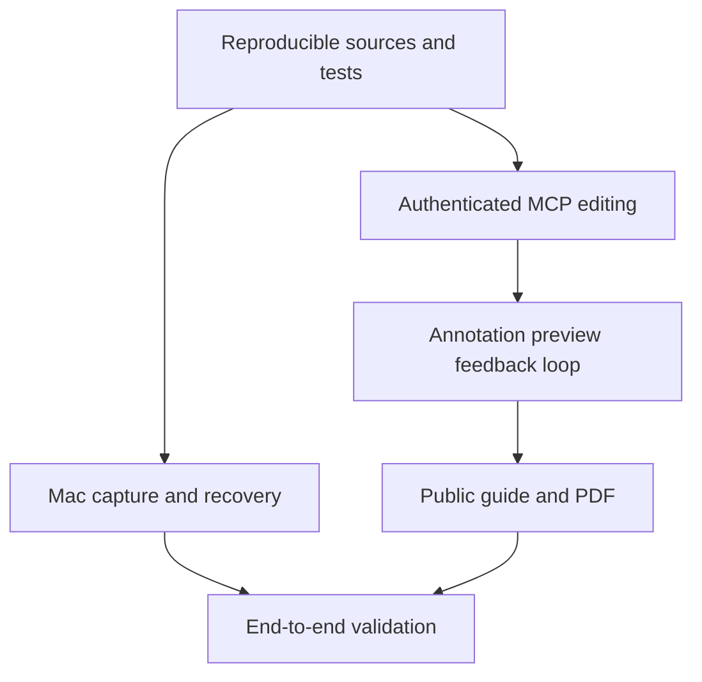

# Captuto: native captures, agent-authored guides

## Accepted scope
A human records a desktop workflow and narration, or an external agent captures
a web workflow using agent-browser and the portable Captuto skill. On the user's
request, the agent discovers and performs the workflow, uploads screenshots and
action metadata, writes the guide, adds editable annotations and inspects previews.
The output is Captuto's native tutorial format, not a video file. Capture can span
multiple sites and resume after interruption. Existing tutorials can be corrected
and continued. Published guides are edited as private revisions and replaced only
after the user's go, retaining their public link. Native macOS control comes later;
existing native sources, narration and guide content remain available for editing.

## Delivery criteria
- Native Mac recorder is simple, recoverable and captures audio and image-relative positions.
- Without a token, Mac offers browser sign-in and automatically receives its own revocable access. No copy/paste or token in a URL is required.
- Authenticated MCP lists recordings, retrieves sources, edits content and annotations,
  returns actual preview images, publishes and exports PDFs. Ownership is enforced.
- Arrows, rectangles, text, highlights and existing annotation types remain editable.
- Preview and PDF use the same annotation renderer; PDF text is selectable and paginated.
- Public guide prioritizes readable instructions and images, with a downloadable PDF.
- Saving during typing preserves newer edits. Failures are visible and retryable.
- A reproducible local smoke scenario exercises the MCP without recording another demo.
- The portable skill captures actual browser viewports, checkpoints each source,
  retries uploads with stable UUIDs, and verifies annotations before completion.
- Private revisions copy sources and authored content. Publishing is transactional,
  preserves original sources and rejects changes made since the revision began.
- Web verified with agent-browser; Mac built and tested with native tooling.

## Design
Simple, warm, recognizable; companions.build is the visual reference. Light paper,
dark typography, restrained coral accents. Native Mac controls adapt to the OS;
Liquid Glass only where supported, functional fallback on older supported systems.

## Dependencies

## Test boundaries
Authenticated tool calls, recording ingestion, render outputs and existing editor
save boundary. Test observable results, rejected cross-user access, invalid geometry,
source preservation and actual PDF/image artifacts. The autonomous smoke scenario
uses agent-browser for all localhost operations, including MCP requests, and tests
real screenshots, lost upload responses and revision publication.

## Exclusions
Browser extension changes, autonomous native macOS control, custom PDF template builder,
commercial billing redesign and a second built-in agent reasoning engine.

## Rollout and rollback
Apply `20260909120000_agent_revisions.sql` before deploying the MCP changes. It
adds nullable revision metadata, a privacy constraint and transactional functions;
existing tutorials are unaffected. Reverting the application is the first rollback
step. Keep the additive schema and private revision tutorials until their content
has been reconciled; dropping revision metadata would lose the original/draft link.
The storage files copied before a transaction remain owner-only if publication
fails. Old original sources are retained after successful publication.
